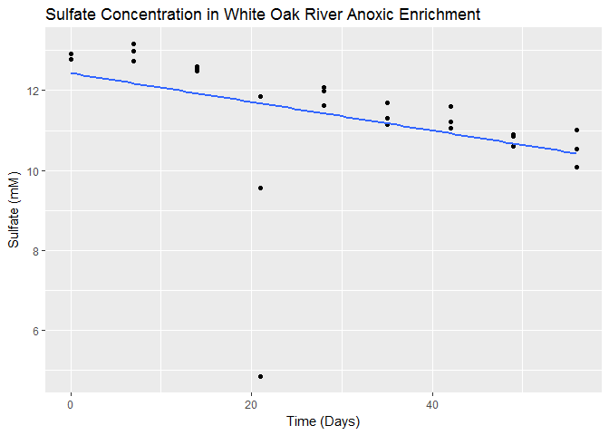

Introduction: The White Oak River (WOR) is an estruine river located
along the coast of North Carolina with well characterized predictable
geochemical properties. Mud was sampled from the site and then incubated
in sealed flasks with no influx of air. As time goes by, the oxygen in
the headspace will be consumed eventually making these incubations
anoxic with the eventual goal of them going methanogenic. However, these
methanogenic conditions cannot be acheived until all of the sulfate has
been consumed by subflate reducing bacteria (SRB) in the culture. In
order to estimate how long it will take for these indubations to go
methanogenic, we can model the loss of sulfate over time and generate a
linear regression which will give us a rate of loss which can be used to
preduct when the cultures will go methanogenic. Data represents
measurements taken weekly between May 20 to July 15, 2016.

    library(ggplot2)
    #data path in R notebook is where .Rmd is saved; needs to be changed for inputs in different folders
    WOR <- read.csv("../data/WOR_Sulfate.csv", header = TRUE, sep = ",")
    #establish csv file as a dataframe for use in ggplot
    WOR_Sulfate <- as.data.frame(WOR)
    structure(WOR_Sulfate)

    ##      ï..Date Days        mM
    ## 1  5/20/2016    0 12.783331
    ## 2  5/20/2016    0 12.918485
    ## 3  5/27/2016    7 13.166268
    ## 4  5/27/2016    7 12.732648
    ## 5  5/27/2016    7 12.971984
    ## 6   6/3/2016   14 12.600310
    ## 7   6/3/2016   14 12.473603
    ## 8   6/3/2016   14 12.546811
    ## 9  6/10/2016   21  4.848655
    ## 10 6/10/2016   21 11.845699
    ## 11 6/10/2016   21  9.562157
    ## 12 6/17/2016   28 11.622976
    ## 13 6/17/2016   28 12.082219
    ## 14 6/17/2016   28 11.980853
    ## 15 6/24/2016   35 11.316345
    ## 16 6/24/2016   35 11.682388
    ## 17 6/24/2016   35 11.144587
    ## 18  7/1/2016   42 11.217795
    ## 19  7/1/2016   42 11.609179
    ## 20  7/1/2016   42 11.048853
    ## 21  7/8/2016   49 10.857384
    ## 22  7/8/2016   49 10.596931
    ## 23  7/8/2016   49 10.902436
    ## 24 7/15/2016   56 10.527946
    ## 25 7/15/2016   56 11.020695
    ## 26 7/15/2016   56 10.088695

    #generate a scatter plot of sulfate vs time with linear regression line 
    ggplot(WOR_Sulfate, aes(x=Days, y=mM)) +
      geom_point() +
      geom_smooth(method=lm, se=FALSE) +
      ggtitle("Sulfate Concentration in White Oak River Anoxic Enrichment")+
      xlab("Time (Days)") + 
      ylab("Sulfate (mM)")

    #Calculate regression to determine rate of sulfate loss
    #Why do I have to present it as y ~ x to get the proper line?
    WOR_Sulfate_Rate <- lm(formula = mM ~ Days, WOR_Sulfate)
    print (WOR_Sulfate_Rate)

    ## 
    ## Call:
    ## lm(formula = mM ~ Days, data = WOR_Sulfate)
    ## 
    ## Coefficients:
    ## (Intercept)         Days  
    ##    12.43183     -0.03582

Results/Discussion: The goal of this analysis was to analyze sulfate
data from anoxic WOR incubations in order to estimate how long until the
incubations go methanogenic. With the analyzed data, we are seeing
sulfate loss at a rate of -0.03582mM/day, or a rate of about 1mM/month.
Given this rate, we would not expect the sulfate in the incubations to
be fully depleated until about May 2017. However, there are limitations
to the presented linear model. While most of the data points from a
given timepoint generally cluster around each other, the data from Day
21 is scattered, which likely skews the model. Removing the anomalous
data points may help generate a more accurate model.
