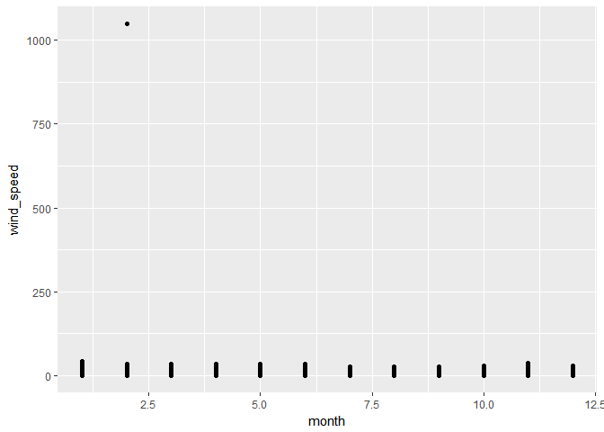
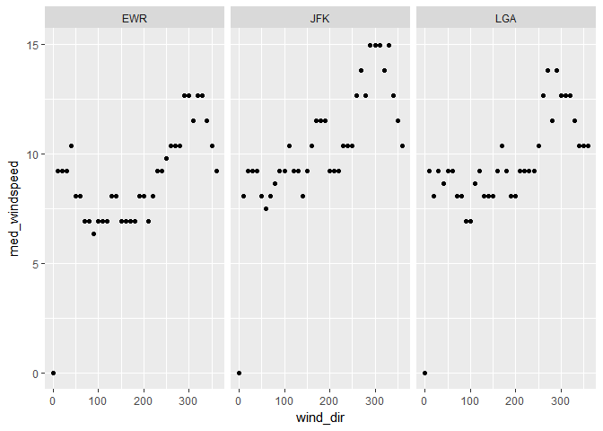
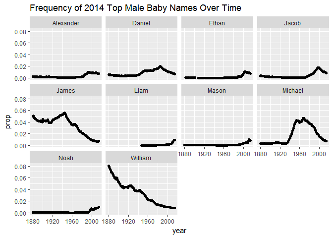
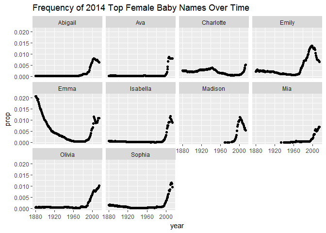

To Do: -Tables for weather data -Select 26-29 most common baby names

    library(tidyverse)

    ## Loading tidyverse: ggplot2
    ## Loading tidyverse: tibble
    ## Loading tidyverse: tidyr
    ## Loading tidyverse: readr
    ## Loading tidyverse: purrr
    ## Loading tidyverse: dplyr

    ## Conflicts with tidy packages ----------------------------------------------

    ## filter(): dplyr, stats
    ## lag():    dplyr, stats

    library(dplyr)
    #install.packages("nycflights13")
    #install.packages("babynames")

Using the nycflights13::weather:

1.  Determine whether there are any clear outliers in wind
    speed (wind\_speed) that should be rejected. If so, filter those
    bad point(s) and proceed. What direction has the highest median
    speed at each airport? Make a table and a plot of median wind speed
    by direction, for each airport.

<!-- -->

    nycflights13::weather %>%
      #determine outliers by graphing it
    ggplot(aes(x=month, y=wind_speed)) +
      geom_point()

    ## Warning: Removed 3 rows containing missing values (geom_point).

      #there is a clear outlier at the top, manually set filter
    nycflights13::weather %>% 
      filter(wind_speed < 250) %>%
      group_by(origin, wind_dir)%>%
      summarise(med_windspeed = median(wind_speed))%>%
      #top median wind speeds per airport and direction
      top_n(1)

    ## Selecting by med_windspeed

    ## Source: local data frame [10 x 3]
    ## Groups: origin [3]
    ## 
    ##    origin wind_dir med_windspeed
    ##     <chr>    <dbl>         <dbl>
    ## 1     EWR      290      12.65858
    ## 2     EWR      300      12.65858
    ## 3     EWR      320      12.65858
    ## 4     EWR      330      12.65858
    ## 5     JFK      290      14.96014
    ## 6     JFK      300      14.96014
    ## 7     JFK      310      14.96014
    ## 8     JFK      330      14.96014
    ## 9     LGA      270      13.80936
    ## 10    LGA      290      13.80936

    #plot median wind speed by direction by airport
    nycflights13::weather %>% 
      filter(wind_speed < 250) %>%
      group_by(origin, wind_dir)%>%
      summarise(med_windspeed = median(wind_speed))%>%
      #table
      print() %>%
      #plot
      ggplot(aes(x=wind_dir, y=med_windspeed)) +
        geom_point() +
        facet_wrap(~origin)

    ## Source: local data frame [114 x 3]
    ## Groups: origin [?]
    ## 
    ##    origin wind_dir med_windspeed
    ##     <chr>    <dbl>         <dbl>
    ## 1     EWR        0       0.00000
    ## 2     EWR       10       9.20624
    ## 3     EWR       20       9.20624
    ## 4     EWR       30       9.20624
    ## 5     EWR       40      10.35702
    ## 6     EWR       50       8.05546
    ## 7     EWR       60       8.05546
    ## 8     EWR       70       6.90468
    ## 9     EWR       80       6.90468
    ## 10    EWR       90       6.32929
    ## # ... with 104 more rows

    ## Warning: Removed 3 rows containing missing values (geom_point).

Using nycflights13::flights and nycflights13::airlines:

1.  Make a table with two columns: airline name (not carrier code) and
    median distance flown from JFK airport. The table should be arranged
    in order of decreasing mean flight distance. Hint: use a \_join
    function to join flights and airlines.

<!-- -->

    nycflights13::flights  %>%
      filter(origin == "JFK") %>%
      select(carrier, origin, distance) %>%
      group_by(carrier) %>%
      summarise(med_distance = median(distance)) %>%
      left_join(nycflights13::airlines, by="carrier")  %>%
      select(name, med_distance) %>%
      arrange(desc(med_distance))

    ## # A tibble: 10 × 2
    ##                        name med_distance
    ##                       <chr>        <dbl>
    ## 1    Hawaiian Airlines Inc.         4983
    ## 2     United Air Lines Inc.         2586
    ## 3            Virgin America         2475
    ## 4      Delta Air Lines Inc.         1990
    ## 5    American Airlines Inc.         1598
    ## 6           JetBlue Airways         1028
    ## 7           US Airways Inc.          541
    ## 8         Endeavor Air Inc.          427
    ## 9                 Envoy Air          425
    ## 10 ExpressJet Airlines Inc.          228

Using nycflights13::flights and nycflights13::airlines: 3) Make a
wide-format data frame that displays the number of flights that leave
Newark ("EWR") airport each month, from each airline

    nycflights13::flights %>%
      filter(origin == "EWR") %>%
      select(origin, carrier, month) %>%
      group_by(carrier, month) %>%
      summarise(Flights = n()) %>%
      left_join(nycflights13::airlines, by="carrier") %>%
      select(name, month, Flights) %>%
    #why does this work???????
      #spread(new columns, what to populate them with)
      spread(month, Flights)

    ## Adding missing grouping variables: `carrier`

    ## Source: local data frame [12 x 14]
    ## Groups: carrier [12]
    ## 
    ##    carrier                     name   `1`   `2`   `3`   `4`   `5`   `6`
    ## *    <chr>                    <chr> <int> <int> <int> <int> <int> <int>
    ## 1       9E        Endeavor Air Inc.    82    75    91    88   103    88
    ## 2       AA   American Airlines Inc.   298   268   295   288   297   291
    ## 3       AS     Alaska Airlines Inc.    62    56    62    60    62    60
    ## 4       B6          JetBlue Airways   573   532   612   567   517   506
    ## 5       DL     Delta Air Lines Inc.   279   249   319   364   377   347
    ## 6       EV ExpressJet Airlines Inc.  3838  3480  3996  3870  4039  3661
    ## 7       MQ                Envoy Air   212   196   228   220   226   218
    ## 8       OO    SkyWest Airlines Inc.    NA    NA    NA    NA    NA     2
    ## 9       UA    United Air Lines Inc.  3657  3433  3913  4025  3874  3931
    ## 10      US          US Airways Inc.   363   328   372   361   381   390
    ## 11      VX           Virgin America    NA    NA    NA   170   186   180
    ## 12      WN   Southwest Airlines Co.   529   490   532   518   530   501
    ## # ... with 6 more variables: `7` <int>, `8` <int>, `9` <int>, `10` <int>,
    ## #   `11` <int>, `12` <int>

Using the babynames dataset: 4) Identify the ten most common male and
female names in 2014. Make a plot of their frequency (prop) since 1880.
(This may require two separate piped statements).

    #identify top 10 male names in 2014
    babynames::babynames %>%
      filter(sex=="M", year == "2014") %>%
      top_n(10) %>%
      select(name) %>%
    #what makes left join different from right join --> not quite sure why this works but it does
      left_join(babynames::babynames, by = "name") %>%
    #refilter because Noah is a M and F name
      filter(sex=="M") %>%
      ggplot(aes(x=year, y=prop)) +
        geom_point() +
        ggtitle("Frequency of 2014 Top Male Baby Names Over Time") +
        facet_wrap("name")

    ## Selecting by prop

    #identify top 10 female names in 2014
    babynames::babynames %>%
      filter(sex == "F", year == "2014") %>%
      top_n(10) %>%
      select(name) %>%
      left_join(babynames::babynames, by = "name") %>%
      filter(sex == "F") %>%
      ggplot(aes(x=year, y=prop)) +
        geom_point() +
        ggtitle("Frequency of 2014 Top Female Baby Names Over Time") +
        facet_wrap("name")

    ## Selecting by prop

Using the babynames dataset: 5) Make a single table of the 26th through
29th most common girls names in the year 1896, 1942, and 2016

    babynames::babynames %>%
      filter(sex == "F", year == "1896"| year == "1942"| year == "2016") %>%
      select(year, name, n) %>%
      group_by(year) %>%
    #Figure out why this works... Select the first 29 instances based on n
      top_n(29, n) %>%
    #Then from those 29, the bottom 4 rows would be 26-29
      top_n(-4, n) %>%
      print()

    ## Source: local data frame [8 x 3]
    ## Groups: year [2]
    ## 
    ##    year    name     n
    ##   <dbl>   <chr> <int>
    ## 1  1896  Martha  2022
    ## 2  1896  Esther  1964
    ## 3  1896 Frances  1964
    ## 4  1896   Edith  1932
    ## 5  1942   Helen 10014
    ## 6  1942 Marilyn  9904
    ## 7  1942   Diane  9550
    ## 8  1942  Martha  9513

    #no data from 2016
